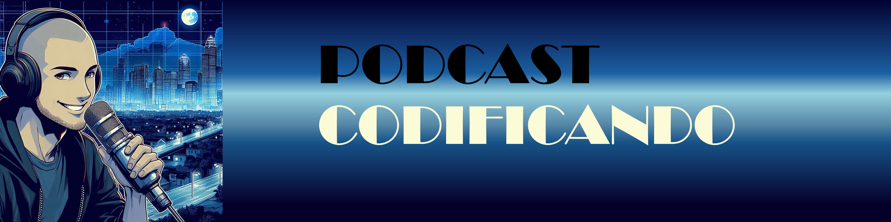

<p align="center">


# 🤖Projeto Podcast Gerado por I.A.s

1. **Este projeto tem como objetivo a construção de um podcast utilizando "Inteligencia artificial"**
2. **Todo o conteúdo exposto foi gerado por AIs e revizado por humano**
-------
## 🔌💻Tecnologias utilizadas
- [ChatGPT](https://chatgpt.com/)
- [Elevenlabs](https://elevenlabs.io/)
- [Designe Copilot](https://copilot.microsoft.com/images/create)
- [Capcut](https://www.capcut.com/my-edit?start_tab=video)
-------
## 🪛 Como foi criado
1. Roteiro criado via **ChatGPT** via prompt
2. Criação de imagens no **Designe** via prompt
3. Dando vida ao roteiro utilizando **Elevenlabs**
4. Criação do podcast no **Capcut** "add efeitos e musica de fundo"
```bash

 OBS:
 
 Elevenlabs
 Voice - Harry

 Cutcap
 Music - Cool and Stylish Drum´n Bass
 Effect - Cheers 1 (wow! pachi pachi pachi)
```
-------
## 📄 Prompts utilizados

1. [ChatGPT](textos/prompt_1.md)
2. [ChatGPT](textos/prompt_2.md)
3. [Designe Copilot](textos/Prompt_3.md)
-------

### 🪪 Expert

[](https://www.linkedin.com/in/leandro-cruz-9ab17a2b3/)
[](https://www.instagram.com/leanddro_cruz/)
[](https://github.com/Cruzzleo)
[](https://wa.me/55+11+S974761727)
[](mailto:cruzz_leandro@icloud.com)

### Com carinho 💟 Leandro cruz
=======
